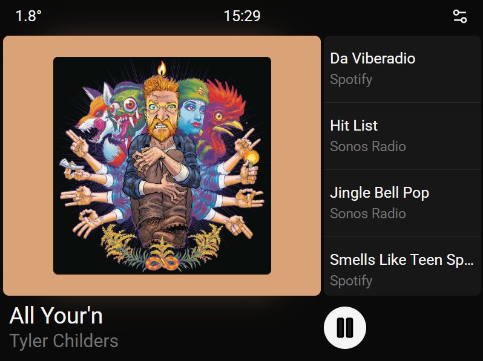

# tunehub

A touchscreen-first UI for controlling audio playback across multiple devices. I built this to run on a Raspberry Pi with a touchscreen, but it should work on any device with a web browser.

## Installation

1. Clone the repository:

```bash
git clone https://github.com/sumis34/tunehub.git
```

1. Navigate to the project directory:

```bash
cd tunehub
```

1. Build the project:

```bash
pnpm install
pnpm run build
```

1. Copy the `dist` directory to your Raspberry Pi:

```bash
scp -r .\dist\ noe@pi:/home/noe/tunehub
```

1. SSH into your Raspberry Pi:

```bash
ssh noe@pi
```

1. Navigate to the `tunehub` directory:

```bash
cd tunehub
```

1. Run the installation script:

```bash
./install.sh
```

1 Verify that the TuneHub service is running:

```bash
systemctl status tunehubd
```

1 Launch chromium in kiosk mode to start using TuneHub:

```bash
DISPLAY=:0 nohup chromium http://192.168.1.109:5173 --kiosk --start-fullscreen -disable-pinch --incognito
```

## Usage

### Debugging

- Tripple click the time in the header to reload the window.