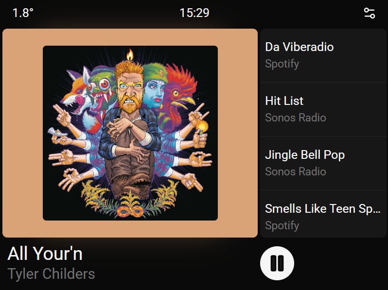

<p align="center">
  
</p>

# TuneHub

A UI for controlling Sonos speakers, designed to be setup in a living room and gives the whole family and visitors easy access to the Sonos system without needing to use a phone or tablet.

## Features

- **Playback Controls**: Play, pause, skip tracks, and adjust volume directly from the interface.
- **Now Playing Info**: View current track information and album art.
- **Shortcuts**: Quick access to favorite playlists and radio stations from configured in the Sonos app.
- **Device Management**: Easily switch between multiple Sonos devices on your network.
- **Touchscreen-Friendly UI**: Optimized for use on small touchscreen displays. ( e.g. Raspberry Pi with a touchscreen )

## About

If you think of an embedded device, React and Python might not be the first technologies that come to mind. However, there is a saying: "Use the tools you know". And since I am most familiar with React I decided to give it a try. The reason I chose Python for the backend is that it has a mature Sonos library (SoCo) which makes it easy to interact with Sonos devices.

Besides that there are a few advantages of using these technologies:

- It is cross platform and mostly just works.
- It is easy to develop modern UIs with React.

Some of the caveats are that a fairly recent Raspberry Pi is required to run the UI smoothly and that the startup time is a bit longer compared to a native application. I would recommend choosing a lightweight OS like Raspberry Pi OS Lite and only install the necessary packages to keep resource usage low.

## Installation

### Hardware Specific Setup

This setup is meant for Pi OS Lite Trixie and the [3.5inch DPI LCD](https://www.waveshare.com/wiki/3.5inch_DPI_LCD?srsltid=AfmBOoqEQ8b2K71XAvbje4K5-Gjc011bOH9yJL84BaxcW-uSN3YL_Jjs) screen.

1. Follow the instructions in the [Waveshare Wiki](https://www.waveshare.com/wiki/3.5inch_DPI_LCD?srsltid=AfmBOoqEQ8b2K71XAvbje4K5-Gjc011bOH9yJL84BaxcW-uSN3YL_Jjs).

1. Install Chromium and xserver-xorg:

```bash
sudo apt update
sudo apt full-upgrade -y

sudo apt install --no-install-recommends \
  xserver-xorg-core \
  xserver-xorg-video-all \
  xserver-xorg-input-all \
  xinit \
  x11-xserver-utils \
  chromium \
  unclutter
```

1. Enable autologin.

```bash
sudo raspi-config
# Auto login > Console Autologin > Yes
```

1. Auto-Start X Only on the Physical Console

```bash
nano ~/.bash_profile
```

Add:

```bash
if [ -z "$DISPLAY" ] && [ "$(tty)" = "/dev/tty1" ]; then
  startx -- -nocursor
fi
```

### Prerequisites

- A Raspberry Pi (preferably Raspberry Pi 4 or newer) with Raspberry Pi OS installed.
- A touchscreen display connected to the Raspberry Pi.
- Python installed on the Raspberry Pi.
- Hardware setup as described in the [Hardware Specific Setup](#hardware-specific-setup) section.

### Steps

1. Clone the repository on your local machine:

```bash
git clone https://github.com/sumis34/tunehub.git
```

1. Navigate to the project directory:

```bash
cd tunehub
```

1. Build the project:

```bash
pnpm install
pnpm run build
```

1. Remove any existing `tunehub` directory and uninstall previous versions:

```bash
# On your Raspberry Pi
cd tunehub && sudo ./uninstall.sh
```

1. Copy the `dist` directory to your Raspberry Pi:

```bash
scp -r .\dist\ noe@pi:/home/noe/tunehub
```

1. SSH into your Raspberry Pi:

```bash
ssh noe@pi
```

1. Run the installation script:

```bash
cd tunehub && dos2unix install.sh && chmod +x install.sh && ./install.sh
```

1. Verify that the TuneHub service is running:

```bash
systemctl status tunehubd
```

## User Guide

### Debugging

- Tripple click the time in the header to reload the window.

## Development

It's the simplest if you run the server and UI on your local machine and just connect to it from the Raspberry Pi or any other device you intend to use later. This way you can develop and test without having to copy files to the Pi every time but you can still see how it looks and works on the target device display.

```bash
# On the target device (e.g. Raspberry Pi)
DISPLAY=:0 nohup chromium http://YOUR_LOCAL_IP:5173 --kiosk --start-fullscreen -disable-pinch --incognito
```
